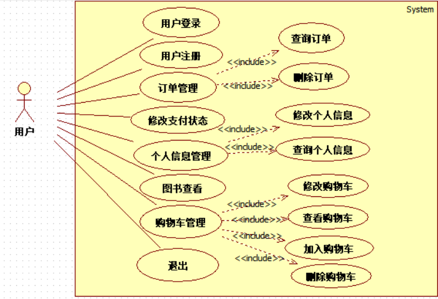
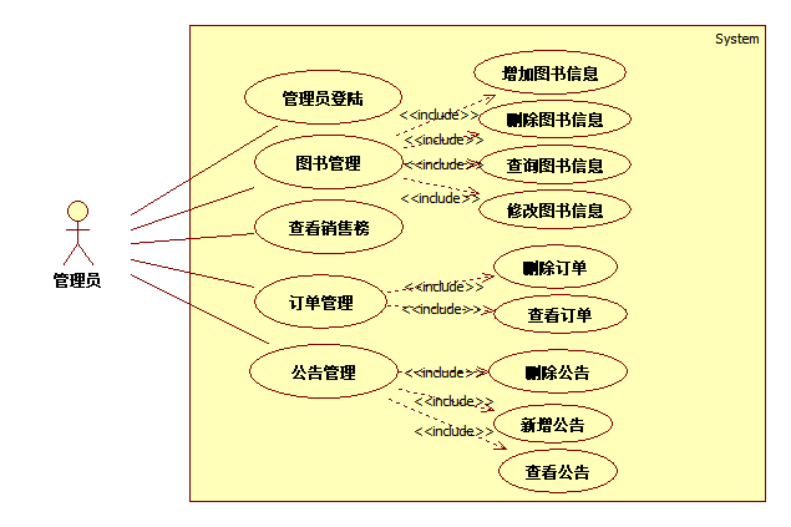
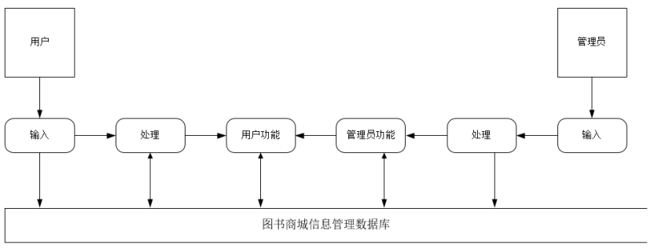
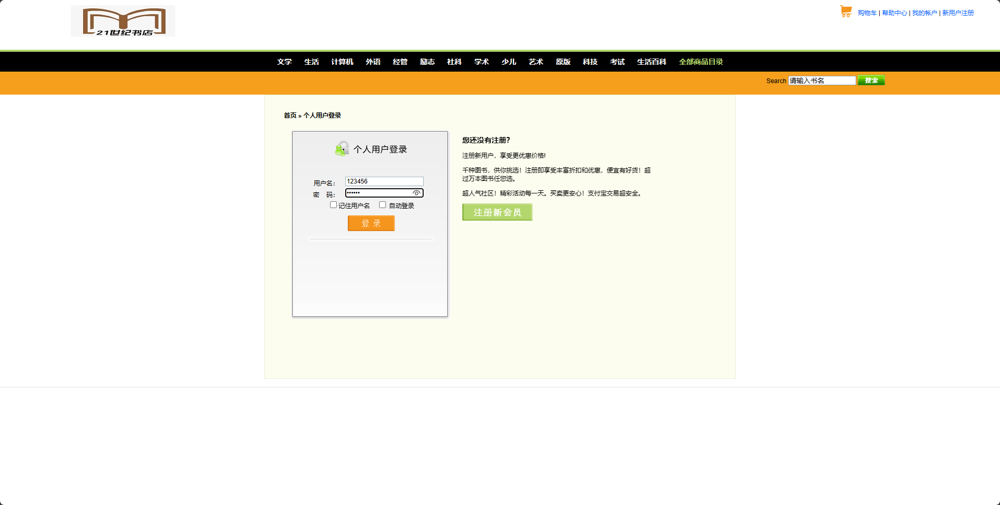

# 基于java的线上书刊销售管理系统

## 一、系统介绍

后台管理员登录包含以下功能：

- 权限管理，店铺管理，商品管理，订单管理，用户管理

前台功能：

- 注册，登录，
- 浏览商品、下单

## 二、环境介绍

系统环境：windows10

基础环境 ：eclipse、javaSE-1.7(jre)、MySQLl5.7、Maven3.9.5、Navicat for MySQL、Tomcat7.0

## 四、用例图

> 用户用例图

> 管理员用例图

## 五、数据流图

> 数据流图

## 六、e-r图

> 公告e-r图

> 图书e-r图

> 用户e-r图

> 管理员e-r图

> 订单e-r图
## 六、运行样例图

> 首页

> 登入界面
## 浏览地址

- 前台地址  http://localhost:8080/   账号： 123456密码： 123456
- 后台地址(管理员登录) http://localhost:8080/账号： admin  密码：123456
